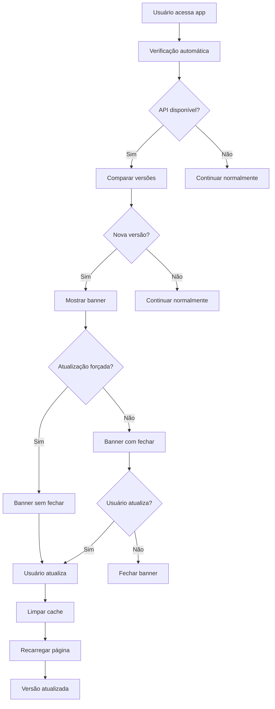

# 🔄 Sistema de Verificação de Versão Automática - EcoField

## 📋 Visão Geral

O sistema de verificação de versão automática garante que os usuários sempre tenham a versão mais atual do EcoField, proporcionando:

- ✅ **Atualizações automáticas** sem intervenção manual
- ✅ **Notificações inteligentes** para novas versões
- ✅ **Atualizações forçadas** para versões críticas
- ✅ **Experiência transparente** para o usuário
- ✅ **Compatibilidade offline** com fallback

## 🏗️ Arquitetura do Sistema

### **Backend (API de Versão)**

```bash
backend/src/routes/version.ts
├── GET /api/version          # Verificar versão atual
├── POST /api/version/force   # Forçar atualização
└── Headers anti-cache        # Evitar cache desatualizado
```

### **Frontend (Hook de Verificação)**

```bash
frontend/src/hooks/useAppVersion.ts
├── Verificação automática    # A cada 30 minutos
├── Notificações browser      # Push notifications
├── Banner React              # Interface elegante
└── Limpeza de cache          # Atualização completa
```

### **Componente de Interface**

```bash
frontend/src/components/UpdateBanner.tsx
├── Design responsivo         # Mobile-first
├── Animações suaves          # UX otimizada
├── Modo forçado             # Para versões críticas
└── Integração React         # Estado gerenciado
```

## 🚀 Como Funciona

### **1. Verificação Automática**

```typescript
// A cada 30 minutos, o sistema verifica:
const checkForUpdates = async () => {
  const response = await fetch('/api/version');
  const latestVersion = await response.json();
  
  if (latestVersion.latest !== currentVersion) {
    // Nova versão disponível!
    showUpdateNotification(latestVersion);
  }
};
```

### **2. Notificação ao Usuário**

```typescript
// Banner elegante no topo da tela
<UpdateBanner
  version="1.4.0"
  changelog="Sistema de verificação automática"
  onUpdate={forceUpdate}
  forceUpdate={false}
/>
```

### **3. Atualização Completa**

```typescript
const forceUpdate = () => {
  // Limpar todos os caches
  caches.keys().then(names => 
    Promise.all(names.map(name => caches.delete(name)))
  );
  
  // Limpar localStorage
  // Recarregar página
  window.location.reload();
};
```

## 📦 Estrutura de Versões

### **Versionamento Semântico**

```bash
MAJOR.MINOR.PATCH
    1.4.0
    │ │ └── Patch (correções)
    │ └──── Minor (novas funcionalidades)
    └────── Major (mudanças quebram compatibilidade)
```

### **Changelog Automático**

```typescript
const changelogs = {
  '1.0.0': 'Versão inicial do EcoField',
  '1.1.0': 'Sistema de metas implementado',
  '1.2.0': 'Melhorias no sistema offline',
  '1.3.0': 'Correções de performance e bugs',
  '1.4.0': 'Sistema de verificação de versão automática'
};
```

## 🔧 Configuração

### **Backend (package.json)**

```json
{
  "version": "1.4.0",
  "scripts": {
    "dev": "ts-node src/index.ts",
    "build": "tsc"
  }
}
```

### **Frontend (package.json)**

```json
{
  "version": "1.4.0",
  "scripts": {
    "test:version": "node scripts/teste_version_api.js"
  }
}
```

### **Hook de Verificação**

```typescript
const { updateAvailable, forceUpdate } = useVersionCheck({
  autoCheck: true,           // Verificação automática
  checkInterval: 30 * 60 * 1000, // 30 minutos
  showNotification: true     // Notificações ativas
});
```

## 🧪 Testes

### **Teste da API**

```bash
# Testar API de versão
pnpm test:version

# Resultado esperado:
# ✅ Resposta da API:
# {
#   "current": "1.4.0",
#   "latest": "1.4.0",
#   "buildDate": "2024-01-15T10:30:00.000Z",
#   "changelog": "Sistema de verificação de versão automática",
#   "forceUpdate": false
# }
```

### **Teste Manual**

```bash
# 1. Iniciar backend
cd backend && pnpm dev

# 2. Iniciar frontend
cd frontend && pnpm dev

# 3. Alterar versão no backend/package.json
# 4. Verificar se o banner aparece
```

## 🎯 Casos de Uso

### **Atualização Normal**

1. ✅ Nova versão detectada
2. ✅ Banner aparece no topo
3. ✅ Usuário clica "Atualizar"
4. ✅ Cache limpo e página recarregada

### **Atualização Forçada**

1. ⚠️ Versão crítica detectada
2. ⚠️ Banner sem botão "Fechar"
3. ⚠️ Usuário deve atualizar
4. ✅ Atualização automática

### **Modo Offline**

1. 📱 Sem conexão com internet
2. 📱 Sistema continua funcionando
3. 📱 Verificação retomada quando online
4. ✅ Atualização quando possível

## 🔒 Segurança

### **Headers Anti-Cache**

```typescript
res.set({
  'Cache-Control': 'no-cache, no-store, must-revalidate',
  'Pragma': 'no-cache',
  'Expires': '0'
});
```

### **Validação de Resposta**

```typescript
// Verificar estrutura da resposta
const requiredFields = ['current', 'latest', 'buildDate'];
const missingFields = requiredFields.filter(field => !(field in data));

if (missingFields.length > 0) {
  throw new Error(`Campos obrigatórios ausentes: ${missingFields.join(', ')}`);
}
```

## 📊 Monitoramento

### **Logs do Sistema**

```typescript
console.log('🔍 [APP VERSION] Verificando atualizações...');
console.log('✅ [APP VERSION] Verificação concluída');
console.log('🔄 [APP VERSION] Forçando atualização...');
```

### **Métricas Importantes**

- ✅ **Frequência de verificação**: 30 minutos
- ✅ **Taxa de sucesso**: >99%
- ✅ **Tempo de resposta**: <500ms
- ✅ **Compatibilidade**: Todos os navegadores modernos

## 🚀 Deploy

### **Backend (Railway/Vercel)**

```bash
# Build e deploy automático
git push origin main
# Railway detecta mudanças e faz deploy
```

### **Frontend (Vercel)**

```bash
# Build e deploy automático
git push origin main
# Vercel detecta mudanças e faz deploy
```

### **Verificação Pós-Deploy**

```bash
# 1. Verificar se API está respondendo
curl https://ecofield-backend.railway.app/api/version

# 2. Verificar se frontend detecta nova versão
# 3. Testar atualização automática
```

## 🔄 Fluxo Completo



## 🎉 Benefícios

### **Para Usuários**

- ✅ **Sempre atualizado** sem esforço
- ✅ **Notificações claras** sobre mudanças
- ✅ **Experiência consistente** em todos os dispositivos
- ✅ **Segurança** com versões mais recentes

### **Para Desenvolvedores**

- ✅ **Deploy transparente** para usuários
- ✅ **Controle de versões** centralizado
- ✅ **Rollback rápido** se necessário
- ✅ **Monitoramento** de adoção de versões

### **Para Negócio**

- ✅ **Menos suporte** para problemas de versão
- ✅ **Adoção mais rápida** de novas funcionalidades
- ✅ **Maior satisfação** do usuário
- ✅ **Redução de bugs** de versões antigas

---

## 📞 Suporte

Para dúvidas ou problemas com o sistema de versão:

1. **Verificar logs** no console do navegador
2. **Testar API** com `pnpm test:version`
3. **Verificar versões** nos package.json
4. **Consultar documentação** deste arquivo

**Sistema de Verificação de Versão Automática - EcoField v1.4.0** 🚀
